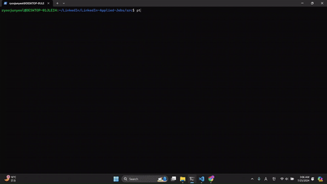
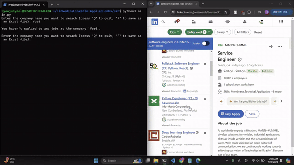
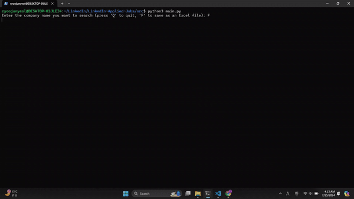

# LinkedIn-Job-Application-Tracker

## Overview:
LinkedIn Job Application Tracker is a Python-based web scraping tool designed to help LinkedIn users determine how many times they have applied for different roles at a specific company. The tool automates the tedious and time-consuming process of searching through each page of your applied jobs to find applications for a particular company. Moreover, if a user selects the option to save as a file, the tracker generates an **Excel file** that includes all of the user's application information.

## The Problem:
When using LinkedIn to track your job applications, LinkedIn only displays 10 applied jobs per page in the "Applied Jobs" section. This can be highly inconvenient and extremely time-consuming for users who apply to many jobs, especially those actively applying to numerous positions across different companies.

## The Solution:
To overcome this problem, the LinkedIn Job Application Tracker automates the entire process. When a user types in a company name, the tool directly shows them all the roles they have already applied to. Here’s how it addresses the issues:
- **Automated Scraping:** The tool automatically navigates through all the pages of your applied jobs, efficiently scraping the data needed to track your applications.
- **Save as a File:** The tool generates an Excel file that includes all application information, such as company name, application date, applied role, and company location.
- **Time Efficiency:** By automating the data collection and search process, it saves users significant time and effort, allowing them to focus more on their job search rather than on tracking applications.

## How to run the program:
```
# Install the required Python packages using pip
pip install openpyxl selenium webdriver-manager

# Navigate to the project directory 
cd /path/to/repo/project

# Run the project
python main.py
```

## Usage:
Run the program, and it will start web scraping to scrape the application data.<br>

<br>

Users can search their application history while applying at the same time.<br>

<br>

Users can download their entire application data as an Excel file.<br>

